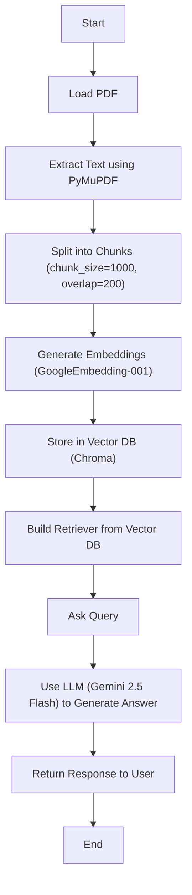

# Project Title: Retrieval-Augmented Generation with Semantic Search

## Overview:

This project demonstrates a simple but effective Retrieval-Augmented Generation (RAG) pipeline using semantic search. A regulatory PDF document is processed, vectorized using embeddings, and queried through a Large Language Model (LLM) for intelligent answers.

## Tech Stack:

| Component       | Tool                           |
| --------------- | ------------------------------ |
| PDF Parsing     | `PyMuPDF (fitz)`               |
| Chunking        | `LangChain TextSplitter`       |
| Embedding Model | `GoogleGenerativeAIEmbeddings` |
| Vector DB       | `Chroma`                       |
| LLM             | `Gemini 2.5 Flash`             |
| Orchestration   | `LangChain`                    |
| Notebook        | `Google Colab`                 |

## Dataset:
Source: Regulations PDF Dataset on Kaggle (https://www.kaggle.com/datasets/terryeppler/regulations-pdf)

## Flow Chart 

## SetUp Instructions:

Install required Libraries 
langchain 
chromadb 
PyMuPDF 
google-generativeai

## Results

| Query                                                                                   | Tool         | Response |
|-----------------------------------------------------------------------------------------|--------------|----------|
| *What are the key points mentioned in the Fiscal Responsibility Act?*                  | `LLM`        | The term "Fiscal Responsibility Act" generally refers to legislation enacted by governments to ensure fiscal discipline, reduce public debt, and promote long-term macroeconomic stability. |
| *What are the key points mentioned in the Fiscal Responsibility Act?*                  | `RAG + LLM`  | - **Purpose:** To provide for a responsible increase to the debt ceiling.   - **Limit Federal Spending:** This is a major division of the Act.   - **Discretionary Spending Limits:** Includes sections on limits for the discretionary category.   - **Special Adjustments:** Covers fiscal years 2024 and 2025.   - **Rescission of Unobligated Funds:** Many sections rescind unobligated funds.   - **Major Federal Action Definition:** Clarifies what qualifies as a major federal action and what is excluded. |

## Acknowledgments

- [Kaggle - Regulations PDF Dataset](https://www.kaggle.com/datasets/terryeppler/regulations-pdf)
- [LangChain](https://www.langchain.com/)
- [Google Generative AI](https://ai.google.dev/)

## Future Plans

-  Extend the current pipeline to process **entire folders** containing multiple regulatory PDFs.
-  Implement a **hybrid retrieval system** by combining:
  -  **Semantic Search** (Vector-based using embeddings)
  -  **BM25 Search** (Traditional keyword-based retrieval)
-  Evaluate and benchmark using **retrieval metrics**:
  -  Precision
  -  Recall
  -  Mean Reciprocal Rank (MRR)
-   Add support for **batch queries** and monitor **retrieval latency**.
-   Develop a **Streamlit-based user interface** for interactive querying of uploaded documents.

